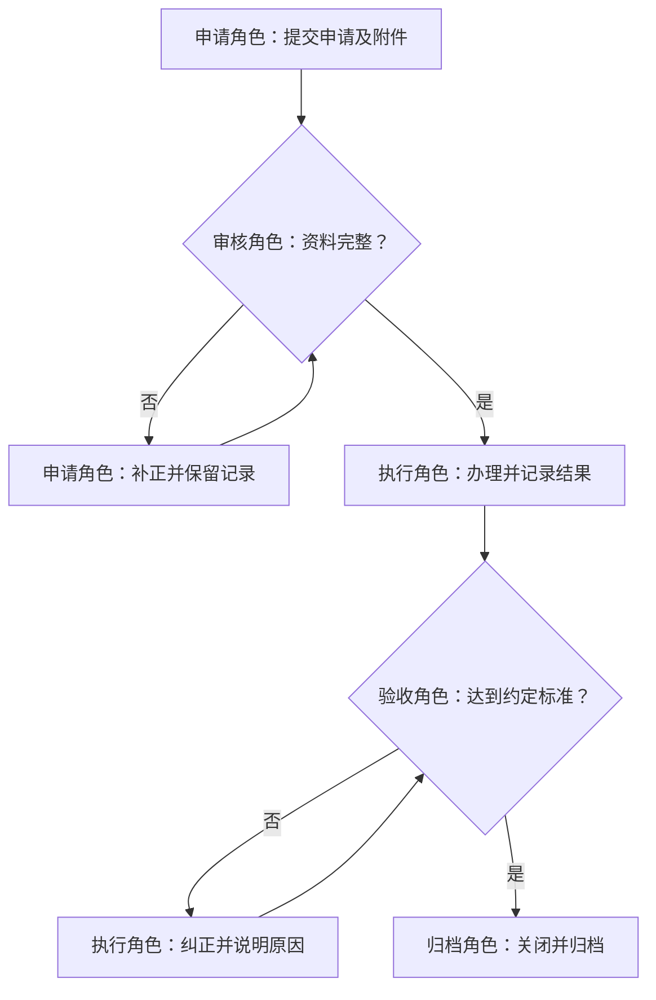

# SOP 交付结构

以下是可调整的起点，不代表公司已批准制度。已有模板优先。

## 文件控制
名称、编号（待确认）、版本、起草/审核/批准角色、生效日期（待确认）、修订说明。

## 正文
目的与范围 → 定义 → 角色职责 → 操作流程 → 异常与回流 → 记录及归档 → 附件。

| 节点 ID | 触发/输入 | 主责角色 | 操作与判断 | 输出/接收者 | 完成标准 | 系统/记录 | 异常返回节点 |
|---|---|---|---|---|---|---|---|

## 审查结论
已确认规则、建议变更、缺口、需由谁确认。审批角色和保管期限没有依据时保留待确认。

## Mermaid 起点
这是演示路径，按实际职责和单据替换。

