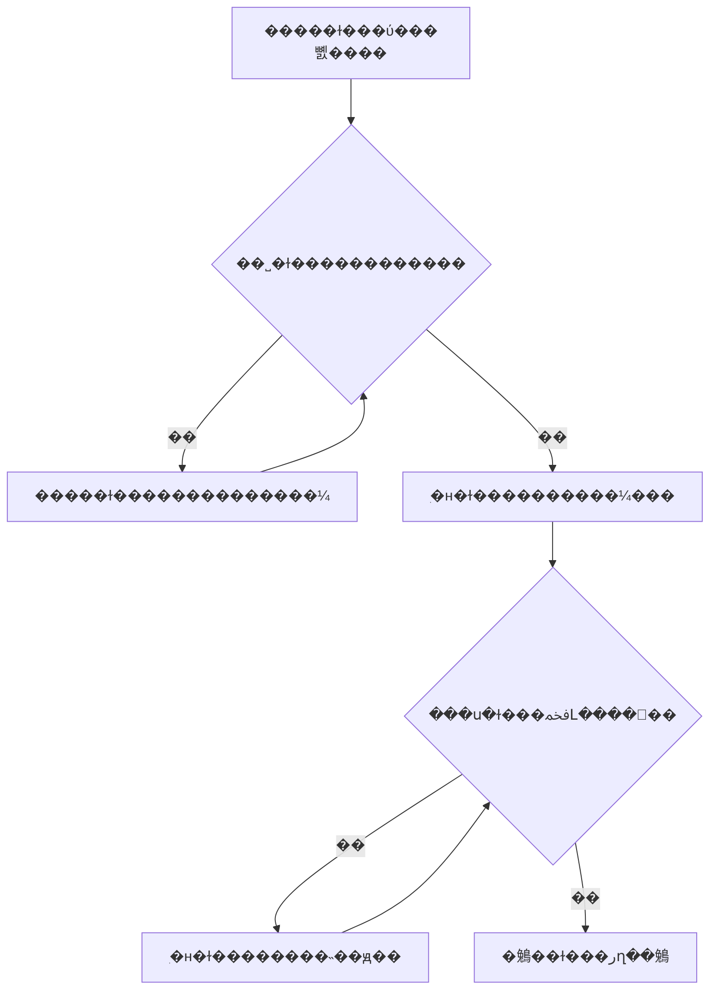

# SOP �����ṹ

�����ǿɵ�������㣬��������˾����׼�ƶȡ�����ģ�����ȡ�

## �ļ�����
���ơ���ţ���ȷ�ϣ����汾�����/���/��׼��ɫ����Ч���ڣ���ȷ�ϣ����޶�˵����

## ����
Ŀ���뷶Χ �� ���� �� ��ɫְ�� �� �������� �� �쳣����� �� ��¼���鵵 �� ������

| �ڵ� ID | ����/���� | �����ɫ | �������ж� | ���/������ | ��ɱ�׼ | ϵͳ/��¼ | �쳣���ؽڵ� |
|---|---|---|---|---|---|---|---|

## ������
��ȷ�Ϲ��򡢽�������ȱ�ڡ�����˭ȷ�ϡ�������ɫ�ͱ�������û������ʱ������ȷ�ϡ�

## Mermaid ���
������ʾ·������ʵ��ְ��͵����滻��

